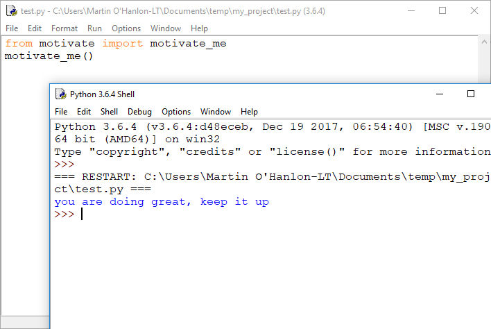

## Introduction

In this project, you will package your own Python code so that others can install and use it.

### What you will make

You will write a basic Python module called `motivate` that prints motivating messages, and learn how to package it.

--- no-print ---

--- /no-print ---

--- print-only ---

--- /print-only ---

--- collapse ---

---
title: What you will learn
---

You will learn:

+ How to structure Python projects
+ How to package Python modules

--- /collapse ---

--- collapse ---

---
title: What you will need
---

### Hardware

+ A computer capable of running Python 3

### Software

+ Python 3

--- /collapse ---

--- no-print ---

If you need to print this project, please use the [printer-friendly version](https://projects.raspberrypi.org/en/projects/packaging-your-code/print){:target="_blank"}.

--- /no-print ---

