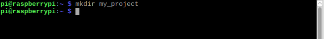
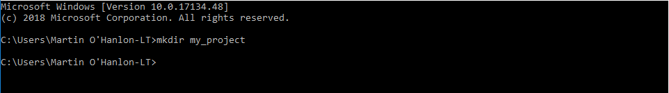

## Build your python package

In this first step you will be creating a python package called `motivate` and structuring the code into a set of directories.

--- task ---

Open a **Command Prompt** (Windows) or **Terminal** (Raspberry Pi, Linux, MacOS).

--- /task ---

--- task ---

Create a directory for your project, this is known as the **distribution** and will hold all the directories and files which make up your project.

```bash
mkdir my_project
```





--- /task ---

--- task ---

Change directory to the new **distribution** directory you just created.

```bash
cd my_project
```

--- /task ---

--- task ---

Create a directory for your python **package**, this directory will hold the code for your Python module.

The name of this directory will also be the name of your python package, in our example this is `motivate`.

```bash
mkdir motivate
```

--- /task ---

--- task ---

Open a Python 3 editor (such as IDLE), create a new file and save it was `me.py` in the Python module directory, `motivate`, you just created.

This python program will hold the python code which will print motivating messages.

--- /task ---


--- task ---

Create a function called `motivate_me` and have it print a message.

```python

def motivate_me():
    print("you are doing great, keep it up")

```

--- /task ---

In order to turn your Python code into a package and provide users access to your new function `motivate_me` you need to create a special file called `init.py` which will **initialise** your package tells Python about its contents.

--- task ---

Create a new file and save it as `__init__.py`.

**Note**: there are 2 underscores `__` before and having the `init`, its important to get this right otherwise your program wont work.

--- /task ---

--- task ---

Add the following code to `__init__.py` to import the `motivate_me` function from the `me.py` module.

```python
from .me import motivate_me
```

--- /task ---

Your project should now have the following structure:

+ **distribution** - `my_project`
  + **package** - `motivate`
    + **module** - `me.py`
    + **initialisation file** - `__init__.py`

You can test this using the `tree` command to print the structure of your project.

--- collapse ---

---
title: Windows
---

Run the command:

```bash
tree /F
```


--- /collapse ---

---
title: Raspberry Pi, Linux, MacOS
---

Run the command :

```bash
tree
```


--- /collapse ---

test your code 


recap the structure of the distribution and the terminology