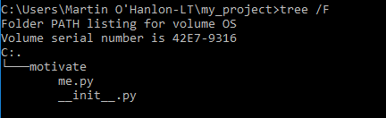
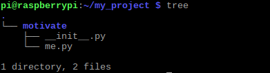
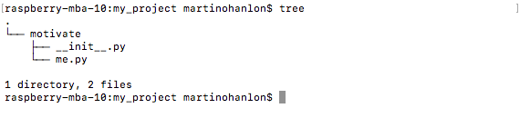
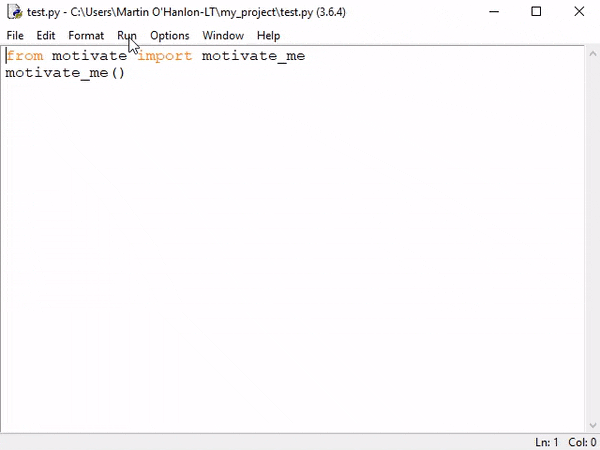

## Build your Python package

In this first step, you will create a Python package called `motivate`, structuring its code into a set of directories.

--- task ---

Open a Command Prompt (Windows) or Terminal (Raspberry Pi, Linux, macOS) window.

--- /task ---

--- task ---

Create a directory `my_project` for your **project**. It will hold all the directories and files that will make up your project.

```bash
mkdir my_project
```

--- /task ---

--- task ---

Change directories to your new project directory.

```bash
cd my_project
```

--- /task ---

--- task ---

Create a directory for your Python package. This directory will hold the code for your Python module.

The name of the directory will be the name of your Python package — in this example, it's `motivate`.

```bash
mkdir motivate
```

--- /task ---

--- task ---

Open a Python 3 editor (such as IDLE), create a new file, and save it as `me.py` in the Python module directory `motivate`.

This Python program will hold the code that will print motivating messages.

--- /task ---

--- task ---

Create a function called `motivate_me`, and have it print a message.

```python

def motivate_me():
    print("you are doing great, keep it up")

```

--- /task ---

To turn your Python code into a package and provide users access to your new function `motivate_me`, you need to create a special file called `__init__.py`, which will **initialise** your package and tell Python about the package contents.

--- task ---

Create a new file and save it as `__init__.py`.

**Note**: there are **two** underscores `_` `_` before and after `init`. It's important to get this right, otherwise your program wont work.

--- /task ---

--- task ---

Add the following code to `__init__.py` to import the `motivate_me` function from the `me.py` module.

```python
from me import motivate_me
```

--- /task ---

Your project should now have the following directory structure:

+ **project** - `my_project`
  + **package** - `motivate`
    + **module** - `me.py`
    + **initialisation file** - `__init__.py`

It's really important you get the structure correct, otherwise you may find that the next steps won't work.

You can test that your project is set up correctly using `tree` on the command line to print the directory and file structure.

--- collapse ---

---
title: Windows
---

Run the command:

```bash
tree /F
```



--- /collapse ---

--- collapse ---

---
title: Raspberry Pi/Linux
---

Run the command:

```bash
tree
```



--- /collapse ---

--- collapse ---

---
title: macOS
---

Run the command:

```bash
tree
```



**Note:** if `tree` is not installed on your machine, you can use the Homebrew package manager command `brew` to install it.

```bash
brew install tree
```

There are instructions for installing Homebrew at [brew.sh](https://brew.sh/).

--- /collapse ---

### Test your code

You should test your module before packaging and installing it.

--- task ---

Create a new Python 3 file and save it in the `my_project` directory as `test.py`.

--- /task ---

--- task ---

Add the following code to import the `motivate_me` function from the `motivate` module.

```python
from me import motivate_me
```

--- /task ---

--- task ---

Add code to call the `motivate_me` function.

```python
motivate_me()
```

--- /task ---

--- task ---

Run the `test.py` program.

--- /task ---

You should see your motivating message appear!



**Note:** there is an example [solution](https://github.com/raspberrypilearning/packaging-your-code/tree/master/en/solutions) in the GitHub repository for this project.
