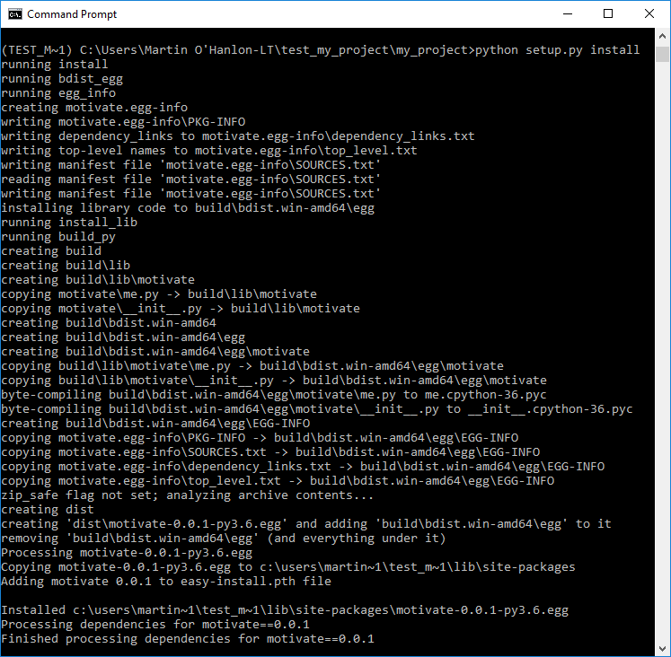
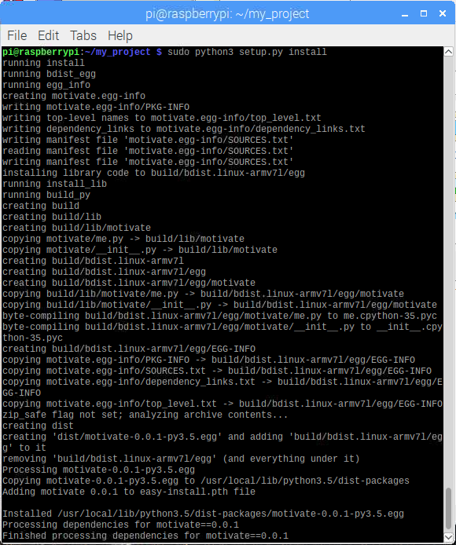
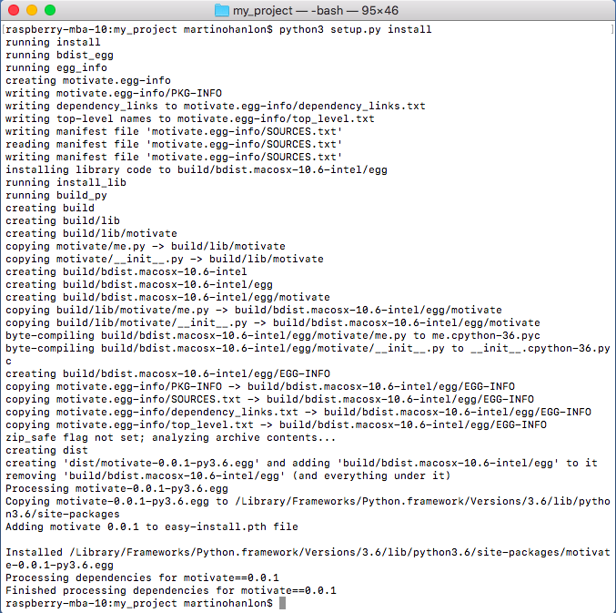

## Install your module

To test your setup program and install your module, you need to run the `setup.py` program from the command line, as you need to pass it the additional `install` parameter.

--- task ---

Run your `setup.py` program.

--- collapse ---

---
title: Windows
---

Open a **Command Prompt** window, change directory (`cd`) to your `my_project` folder, and run:

```bash
python setup.py install
```



--- /collapse ---

--- collapse ---

---
title: Raspberry Pi/Linux
---

Open a **Terminal** winow, change directory (`cd`) to your `my_project` folder, and run:

```bash
sudo python3 setup.py install
```



--- /collapse ---

--- collapse ---

---
title: macOS
---

Open a **Terminal** window, change directory (`cd`) to your `my_project` folder, and run:

```bash
python3 setup.py install
```



--- /collapse ---

--- /task ---

Once the setup program has finished running, if no errors were reported, you should be able to use use the `motivate` module from any Python 3 program running on your computer.

--- task ---

Test the `motivate` module has been installed by recreating the test program, saving it **outside** your `my_project` directory, and running it.

```python
from motivate import motivate_me
motivate_me()
```

**Note:** if you are presented with the error `ImportError: No module named motivate`, the module installation has not been completed successfully.

--- /task ---
